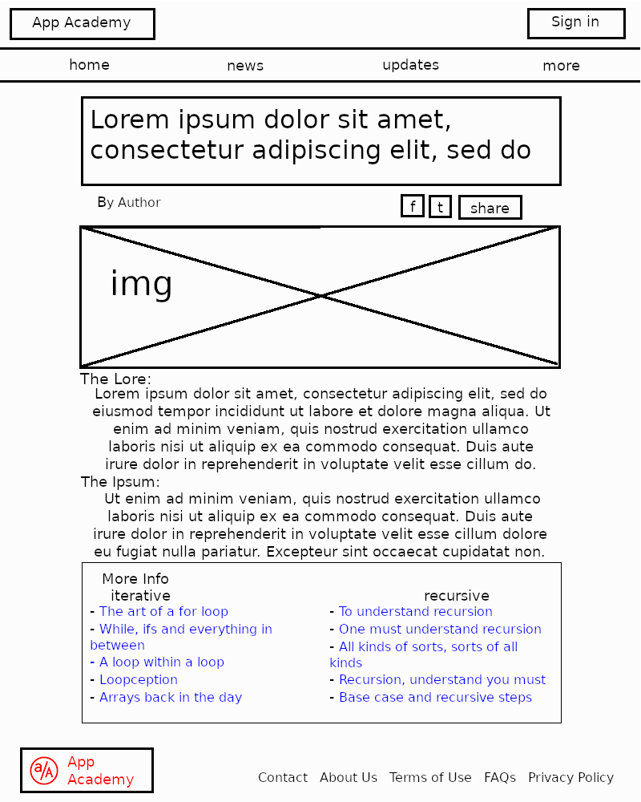

# HTML and CSS Spec Project

Wireframes are quick, lightweight outlines design specs that layout a web page. Being able to discuss and plan your core elements allows your web page to have a solid foundation to build on. This is an important skill when you work on web design and development.

In this project you will be identifying and discussing semantic HTML syntax from an example wireframe.

Include what HTML elements you think each part in the wireframe should have.

Once you have designed the HTML page don't forget to add CSS to your work!

The wireframe should contain at least:

- Main Heading (h1)
- Subheading (h2)
- Main Image (img)
- Text paragraphs (p)
- Links (underlined blue text) (a)
- Lists (ul, ol, li)
- Sections (div)
- Social media icons (identify what tag a social media icon is)

